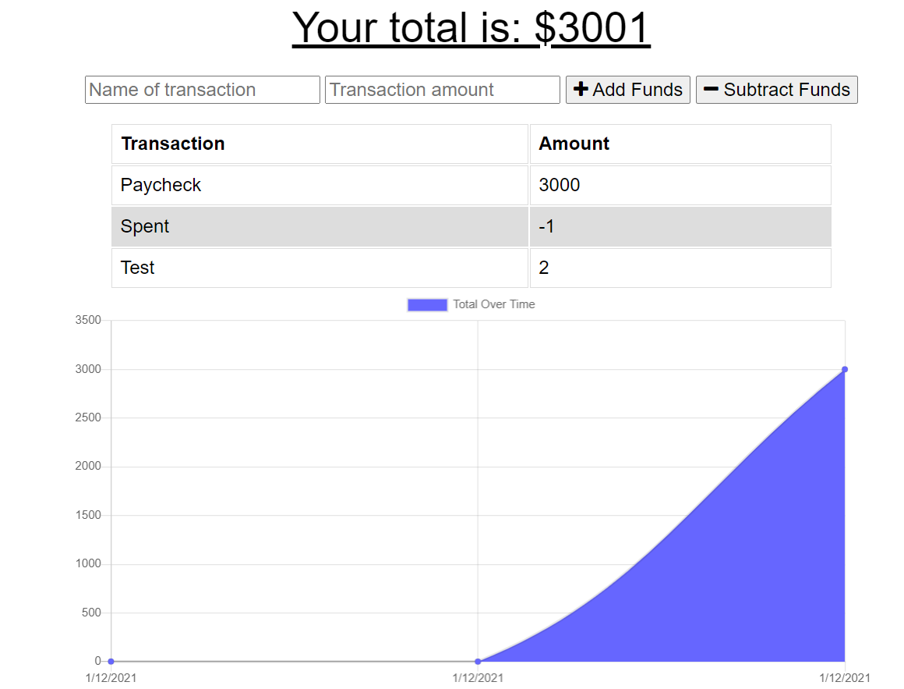

# PWABudgetTracker

A budget tracking app that can be used on/off-line for a traveling person who needs to track their spending

Run online - https://pwabudgettrackeruncral.herokuapp.com/

## Technologies and Getting Started

NodeJS, MongoDB, Express, Mongoose, HTML, JS, CSS

To run locally -
Run "npm i" in the terminal after downloading the repository
Visit "http://localhost:3000" in the browser to use the app
To end the app, go to your terminal and press "CTRL" + "C"

